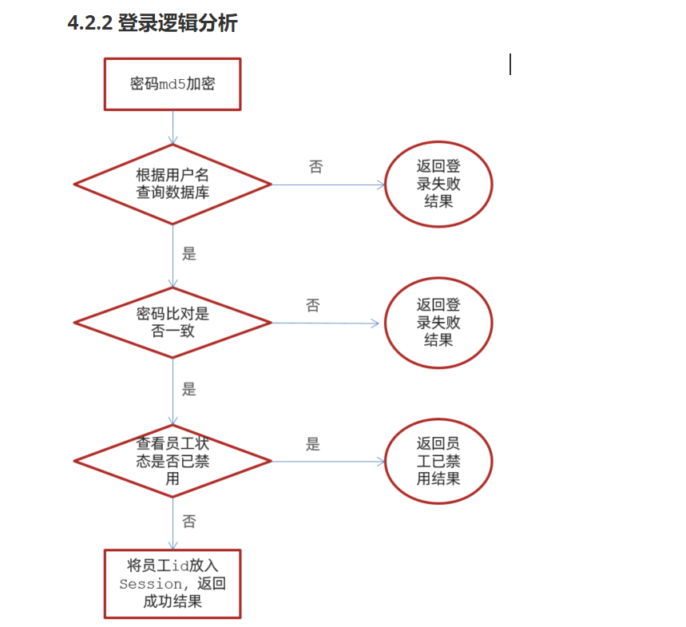
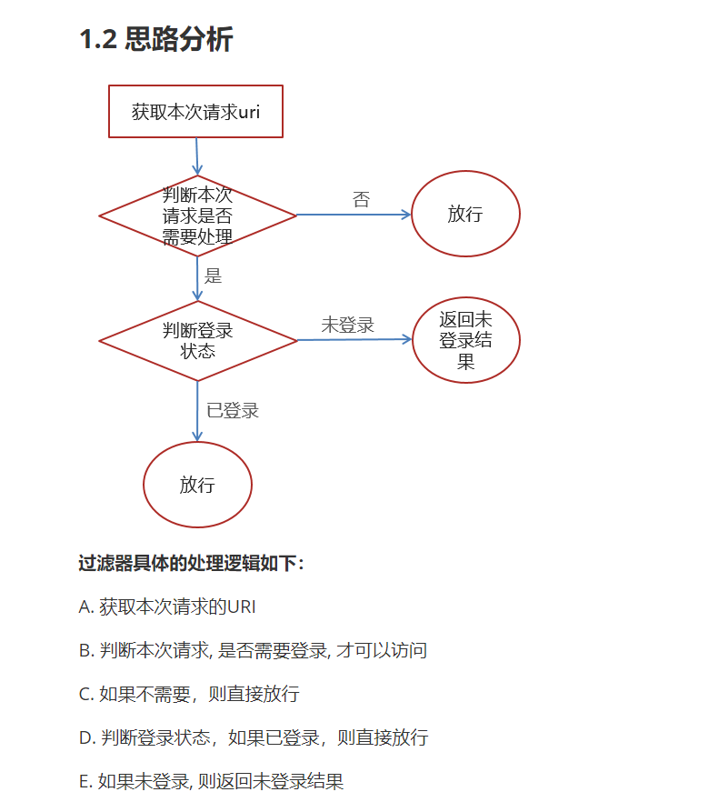
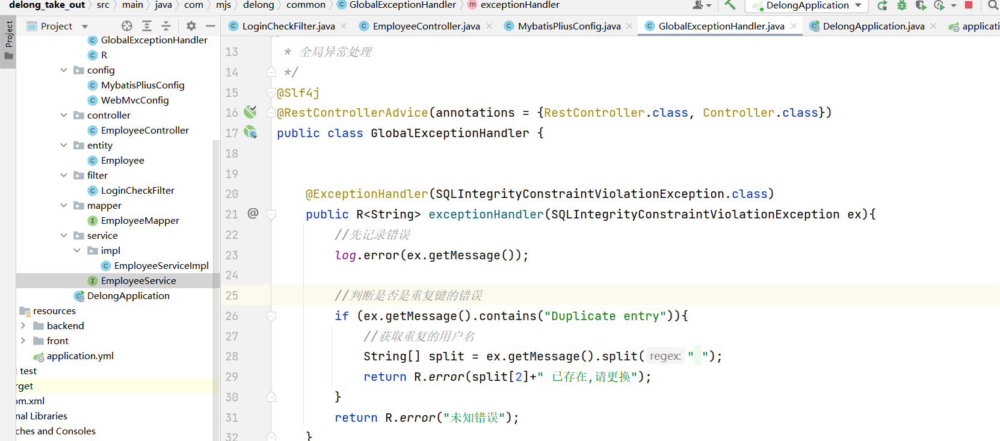
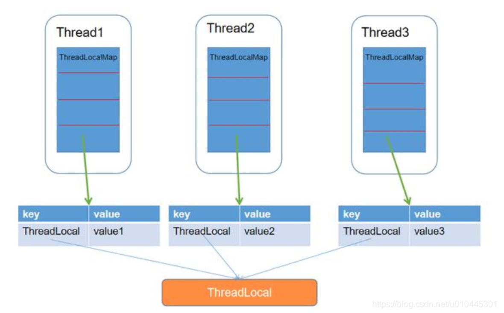
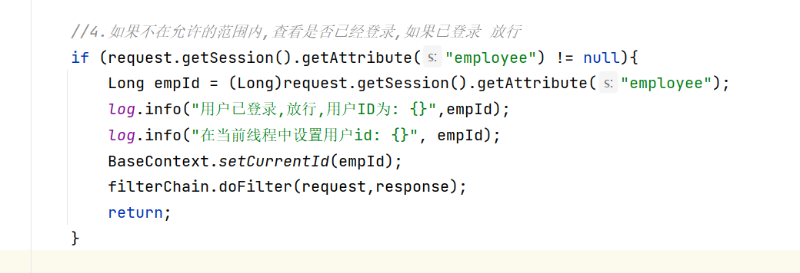
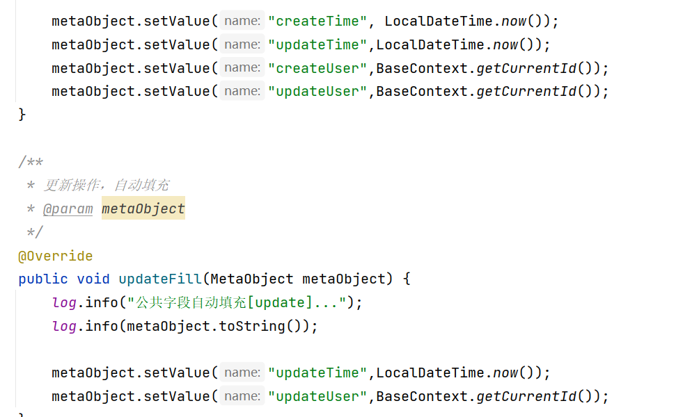
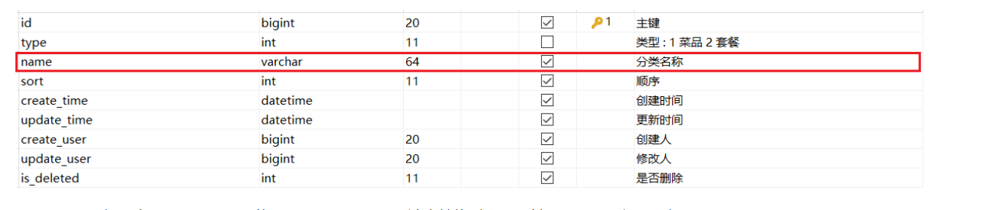
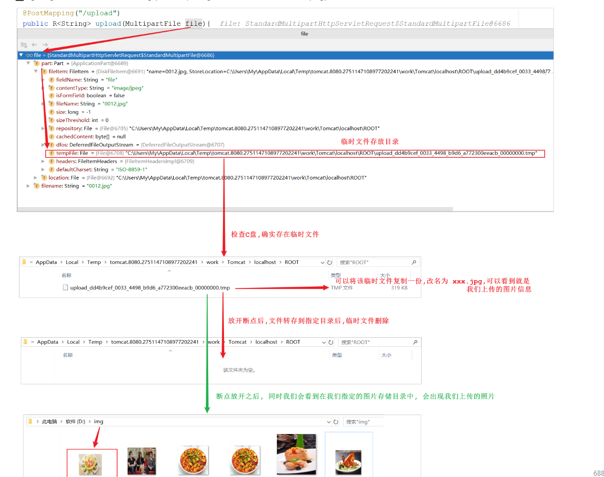
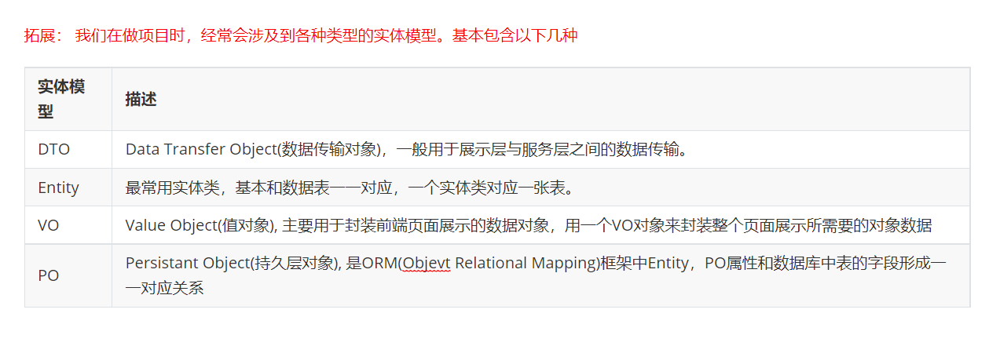

# 外卖逻辑梳理


## 登录逻辑



* 其中md5用DigestUtils.md5DigestAsHex(password.getBytes());   其中AsHex为十六进制 接收为byte数组类型
* 验证两个字符串的时候要把绝对不为空的字段放在前面,避免空指针异常

```java
//4. 如果查询到了就比较两个password,如果不正确,则返回登录失败
        if (!password.equals(emp.getPassword())){ //password为用户提交的密码转换为md5十六进制模式的字符串,绝对不为空,因为前端有校验
            return R.error("登录失败");
        }
```

* 加到session中的字段为从数据库中得到的用户数据,从前端传递过来的仅有username和password


### 登录过滤




## 登出逻辑

* 登出时后台消除session中的employ


## 登录完善

* 注意,静态资源放行,需要过滤器和拦截器都要设置,其中拦截器负责重新导航.
* 在 用户未登录的情况下, 要在过滤器中向前端进行结果返回, 但是过滤器没有把对象自动转换为JSON字符串的功能,需要自己手动进行.

```java
       log.info("用户未登录");
        //5.没有登录时的操作
        response.getWriter().write(JSON.toJSONString(R.error("NOTLOGIN")));
        return;
```


## 添加员工逻辑

* 默认员工的密码为123456,要求用MD5加密

>   employee.setPassword(DigestUtils.md5DigestAsHex("123456".getBytes()));  

* 平时用的登录id为Long类型, 获取时要从Object转换为Long  注意要进行添加更新的方法都要添加HttpServletRequest request来获取当前登录的id


* 针对于数据库返回的错误和服务器中的错误 , 要用全局异常处理进行抓去 , 不能让用户获得不清晰的异常信息.
* 注意全局异常处理器的 @RestControllerAdvice(annotations = {RestController.class, Controller.class})
*  @ExceptionHandler(SQLIntegrityConstraintViolationException.class)




## 员工分页查询

* 注意一开始要配置Mybatis-Plus的分页配置器

* 顺序: 1.现获取分页构造器  new Page(page,pageSize)  
* 2. 构建查询语句
  3. 根据名字有无添加过滤条件lambdaQueryWrapper.like(StringUtils.isNotEmpty(name),Employee::getName,name);  其中StringUtils是Apache包下的
  4. 根据更新时间设置倒叙条件
  5.  调用Service的Page查询  注意 返回的是分页构造器


## 员工状态更新

* 本质上就是员工信息更新 , Mybatis-Plus的UpdateById可以解决这一点

* 前端JS在对长度较长的长整型数据进行处理时， 会损失精度， 从而导致提交的id和数据库中的id不一致。而字符串就不会产生这个问题,

* 那么在我们的业务中, 我们只需要让分页查询返回的json格式数据库中, long类型的属性, 不直接转换为数字类型, 转换为字符串类型就可以解决这个问题了 

* 由于在SpringMVC中, 将Controller方法返回值转换为json对象, 是通过jackson来实现的, 涉及到SpringMVC中的一个消息转换器MappingJackson2HttpMessageConverter, 所以我们要解决这个问题, 就需要对该消息转换器的功能进行拓展。

```java
import com.fasterxml.jackson.databind.DeserializationFeature;
import com.fasterxml.jackson.databind.ObjectMapper;
import com.fasterxml.jackson.databind.module.SimpleModule;
import com.fasterxml.jackson.databind.ser.std.ToStringSerializer;
import com.fasterxml.jackson.datatype.jsr310.deser.LocalDateDeserializer;
import com.fasterxml.jackson.datatype.jsr310.deser.LocalDateTimeDeserializer;
import com.fasterxml.jackson.datatype.jsr310.deser.LocalTimeDeserializer;
import com.fasterxml.jackson.datatype.jsr310.ser.LocalDateSerializer;
import com.fasterxml.jackson.datatype.jsr310.ser.LocalDateTimeSerializer;
import com.fasterxml.jackson.datatype.jsr310.ser.LocalTimeSerializer;
import java.math.BigInteger;
import java.time.LocalDate;
import java.time.LocalDateTime;
import java.time.LocalTime;
import java.time.format.DateTimeFormatter;
import static com.fasterxml.jackson.databind.DeserializationFeature.FAIL_ON_UNKNOWN_PROPERTIES;

/**
 * 对象映射器:基于jackson将Java对象转为json，或者将json转为Java对象
 * 将JSON解析为Java对象的过程称为 [从JSON反序列化Java对象]
 * 从Java对象生成JSON的过程称为 [序列化Java对象到JSON]
 */
public class JacksonObjectMapper extends ObjectMapper {
    public static final String DEFAULT_DATE_FORMAT = "yyyy-MM-dd";
    public static final String DEFAULT_DATE_TIME_FORMAT = "yyyy-MM-dd HH:mm:ss";
    public static final String DEFAULT_TIME_FORMAT = "HH:mm:ss";
    public JacksonObjectMapper() {
        super();
        //收到未知属性时不报异常
        this.configure(FAIL_ON_UNKNOWN_PROPERTIES, false);
        //反序列化时，属性不存在的兼容处理
        this.getDeserializationConfig().withoutFeatures(DeserializationFeature.FAIL_ON_UNKNOWN_PROPERTIES);

        SimpleModule simpleModule = new SimpleModule()
                .addDeserializer(LocalDateTime.class, new LocalDateTimeDeserializer(DateTimeFormatter.ofPattern(DEFAULT_DATE_TIME_FORMAT)))
                .addDeserializer(LocalDate.class, new LocalDateDeserializer(DateTimeFormatter.ofPattern(DEFAULT_DATE_FORMAT)))
                .addDeserializer(LocalTime.class, new LocalTimeDeserializer(DateTimeFormatter.ofPattern(DEFAULT_TIME_FORMAT)))

                .addSerializer(BigInteger.class, ToStringSerializer.instance)
                .addSerializer(Long.class, ToStringSerializer.instance)

                .addSerializer(LocalDateTime.class, new LocalDateTimeSerializer(DateTimeFormatter.ofPattern(DEFAULT_DATE_TIME_FORMAT)))
                .addSerializer(LocalDate.class, new LocalDateSerializer(DateTimeFormatter.ofPattern(DEFAULT_DATE_FORMAT)))
                .addSerializer(LocalTime.class, new LocalTimeSerializer(DateTimeFormatter.ofPattern(DEFAULT_TIME_FORMAT)));
        //注册功能模块 例如，可以添加自定义序列化器和反序列化器
        this.registerModule(simpleModule);
    }
}
```

该自定义的对象转换器, 主要指定了, 在进行json数据序列化及反序列化时, LocalDateTime、LocalDate、LocalTime的处理方式, 以及BigInteger及Long类型数据，直接转换为字符串。


## 编辑员工信息

* 注意虽然前端的员工id是用Long类型进行接收,虽然前面传来的String

* 首先要根据id进行查询, 返回员工信息进行回显
* 再进行根据id的更新 , 更新时注意更新状态值.


## 公共字段填充

* 当我们进行 新增员工 和 修改员工的信息的时候, 每次都需要进行状态值的修改, 这些公共字段的填充时可以通过Mybatis-Plus进行的,当然也可以抽取成一个公共类.

* Mybatis-Plus的填充功能需要实现MetaObjectHandler接口

* 注意，我们在MyMetaObjectHandler类中是不能直接获得HttpSession对象的，所以我们需要通过其他方式来获取登录用户id。


* 客户端发送的每次http请求，对应的在服务端都会分配一个新的线程来处理，在处理过程中涉及到下面类中的方法都属于相同的一个线程：

1). LoginCheckFilter的doFilter方法

2). EmployeeController的update方法

3). MyMetaObjectHandler的updateFill方法

我们可以在上述类的方法中加入如下代码(获取当前线程ID,并输出):

```java
long id = Thread.currentThread().getId();
log.info("线程id为：{}",id);
```


### ThreadLocal

ThreadLocal叫做线程变量，意思是ThreadLocal中填充的变量属于当前线程，该变量对其他线程而言是隔离的，也就是说该变量是当前线程独有的变量。ThreadLocal为变量在每个线程中都创建了一个副本，那么每个线程可以访问自己内部的副本变量。

ThreadLoal 变量，线程局部变量，同一个 ThreadLocal 所包含的对象，在不同的 Thread 中有不同的副本。这里有几点需要注意：

因为每个 Thread 内有自己的实例副本，且该副本只能由当前 Thread 使用。这是也是 ThreadLocal 命名的由来。
既然每个 Thread 有自己的实例副本，且其它 Thread 不可访问，那就不存在多线程间共享的问题。
ThreadLocal 提供了线程本地的实例。它与普通变量的区别在于，每个使用该变量的线程都会初始化一个完全独立的实例副本。ThreadLocal 变量通常被private static修饰。当一个线程结束时，它所使用的所有 ThreadLocal 相对的实例副本都可被回收。

总的来说，ThreadLocal 适用于每个线程需要自己独立的实例且该实例需要在多个方法中被使用，也即变量在线程间隔离而在方法或类间共享的场景

下图可以增强理解：


**ThreadLocal常用方法：**

A. public void set(T value) : 设置当前线程的线程局部变量的值

B. public T get() : 返回当前线程所对应的线程局部变量的值

C. public void remove() : 删除当前线程所对应的线程局部变量的值 


我们可以在LoginCheckFilter的doFilter方法中获取当前登录用户id，并调用ThreadLocal的set方法来设置当前线程的线程局部变量的值（用户id），然后在MyMetaObjectHandler的updateFill方法中调用ThreadLocal的get方法来获得当前线程所对应的线程局部变量的值（用户id）。 如果在后续的操作中, 我们需要在Controller / Service中要使用当前登录用户的ID, 可以直接从ThreadLocal直接获取。


### 实现过程

实现步骤：

1). 编写BaseContext工具类，基于ThreadLocal封装的工具类

2). 在LoginCheckFilter的doFilter方法中调用BaseContext来设置当前登录用户的id

3). 在MyMetaObjectHandler的方法中调用BaseContext获取登录用户的id

```java
/**
 * 基于ThreadLocal封装工具类，用户保存和获取当前登录用户id
 */
public class BaseContext {
    private static ThreadLocal<Long> threadLocal = new ThreadLocal<>();

    /**
     * 设置ThreadLocal的值
     */

    public static void setCurrentId(Long id){
        threadLocal.set(id);
    }

    /**
     * 获取ThreadLocal的值
     */
    public static Long getCurrentId(){
        return threadLocal.get();
    }
}

```

* 注意两个静态方法的返回值, set方法不用返回值  get方法返回的是存在ThreadLocal中的值的类型

* 在在LoginCheckFilter的doFilter方法中调用BaseContext来设置当前登录用户的id



*  在MyMetaObjectHandler的方法中调用BaseContext获取登录用户的id




## 新增分类

* 如果项目中有不同的分类,其模型差不多 那么可能定一个表,用其中一个字段进行区别
* 分类菜单一般有顺序, 要设置顺序字段




## 分类信息分页查询

* 和员工的类似,这次用查询name, 且要根据sort升序排序


## 删除分类

* 在分类管理列表页面，可以对某个分类进行删除操作。需要注意的是当分类关联了菜品或者套餐时，此分类不允许删除。

* 注意从前端接收的是在路径中的  ?id=.....   而不是/...... 所以不用@PathVariable 

* 在业务逻辑操作过程中,如果遇到一些业务参数、操作异常的情况下，我们直接抛出此异常。

```java
/**
 * 自定义异常类
 */
public class CustomException extends RuntimeException{
    public CustomException(String message){
        super(message);
    }
}
```

* 因为在删除分类的时候, 需要根据type 查询是否关联了菜品和套餐两种情况,三张表的操作需要在Service层即业务层完成

```java
@Autowired
private DishService dishService;
@Autowired
private SetmealService setmealService;

/**
 * 根据id删除分类，删除之前需要进行判断
 * @param id
 */
@Override
public void remove(Long id) {
    //添加查询条件，根据分类id进行查询菜品数据
    LambdaQueryWrapper<Dish> dishLambdaQueryWrapper = new LambdaQueryWrapper<>();
    dishLambdaQueryWrapper.eq(Dish::getCategoryId,id);
    int count1 = dishService.count(dishLambdaQueryWrapper);
    //如果已经关联，抛出一个业务异常
    if(count1 > 0){
        throw new CustomException("当前分类下关联了菜品，不能删除");//已经关联菜品，抛出一个业务异常
    }

    //查询当前分类是否关联了套餐，如果已经关联，抛出一个业务异常
    LambdaQueryWrapper<Setmeal> setmealLambdaQueryWrapper = new LambdaQueryWrapper<>();
    setmealLambdaQueryWrapper.eq(Setmeal::getCategoryId,id);
    int count2 = setmealService.count(setmealLambdaQueryWrapper);
    if(count2 > 0){
        throw new CustomException("当前分类下关联了套餐，不能删除");//已经关联套餐，抛出一个业务异常
    }

    //正常删除分类
    super.removeById(id);
}
```

* 注意正常删除的情况,是用方法外的 本类的方法, 所以用super, 而不是this


## 修改分类

* 这次前端完成了回显操作, 只需要根据id修改即可


#### 文件上传

* 上传逻辑:

1). 获取文件的原始文件名, 通过原始文件名获取文件后缀

2). 通过UUID重新声明文件名, 文件名称重复造成文件覆盖

3). 创建文件存放目录

4). 将上传的临时文件转存到指定位置

```java
public R<String> upload(MultipartFile file){
        //file是一个临时文件，需要转存到指定位置，否则本次请求完成后临时文件会删除
        log.info(file.toString());

        //获取文件的原文件名
        String originalFilename = file.getOriginalFilename();
        //获取后缀
        String suffix = originalFilename.substring(originalFilename.lastIndexOf("."));
        //使用UUID作为文件名
        String filename = UUID.randomUUID().toString()+suffix;

        //创建一个目录对象
        File dir = new File(basePath);
        //保证文件地址存在
        if (!dir.exists()){
            //目录不存在需要创建
            dir.mkdirs();
        }

        //将临时文件存放在地址中
        try {
            file.transferTo(new File(basePath+filename));
        } catch (IOException e) {
            e.printStackTrace();
        }
        return R.success(filename);
    }
```

* lastIndexOf(".")是查询最后出现 . 的位置

* 记得在Filter里添加路径
* 将basePath 放在外面, 因为上传和下载都需要




### 文件下载

* 文件下载不是放到结果集R中的, 而是放在字节输出流的, 不用返回值, 输出流用response获得response.getOutPutSteam();
* 文件的输入流用FileInputStream(new File(basepath+filename))
* response要设置ContentType("image/jpeg");

```java
/**
 * 文件下载
 * @param name
 * @param response
 */
@GetMapping("/download")
public void download(String name, HttpServletResponse response){
    try {
        //输入流，通过输入流读取文件内容
        FileInputStream fileInputStream = new FileInputStream(new File(basePath + name));

        //输出流，通过输出流将文件写回浏览器
        ServletOutputStream outputStream = response.getOutputStream();

        response.setContentType("image/jpeg");

        int len = 0;
        byte[] bytes = new byte[1024];
        while ((len = fileInputStream.read(bytes)) != -1){
            outputStream.write(bytes,0,len);
            outputStream.flush();
        }

        //关闭资源
        outputStream.close();
        fileInputStream.close();
    } catch (Exception e) {
        e.printStackTrace();
    }
}
```

## 菜品新增

* 菜品和菜品口味统一使用一个controller

* 开发新增菜品功能，其实就是在服务端编写代码去处理前端页面发送的这4次请求(上传、下载已实现)即可。经过上述的分析，我们还需要在服务端实现两块功能：

* 分类的信息的获取,注意要设置排序条件

* 这里涉及了DTO



* 因为要在一个方法中分别存储Dish和DishFlavor,因此要在Service层进行操作

* 页面传递的菜品口味信息，仅仅包含name 和 value属性，缺少一个非常重要的属性dishId， 所以在保存完菜品的基本信息后，我们需要获取到菜品ID，然后为菜品口味对象属性dishId赋值。

  具体逻辑如下：

  ①. 保存菜品基本信息 ;

  ②. 获取保存的菜品ID ;

  ③. 获取菜品口味列表，遍历列表，为菜品口味对象属性dishId赋值;

  ④. 批量保存菜品口味列表;

* DishDto可以直接用于Dish的保存, save底层执行添加sql语句,执行sql语句会将生成的主键id,重新赋值到dishDto这个对象中,  而且多余的字段不会影响Dish的保存.

* 如何把菜品口味列表的数据全部加上DishId呢?  增强for即可,增强for因为是迭代器实现的, 因此可以对集合中的每个值进行干预,因为每个集合个因子都是对象, 迭代器生成的副本指向的一个对象地址

* 因为要进行两个表的添加操作, 不像上面只是查询, 所以要加上事务

* 在启动类加上开启事务的注解 @EnableTransactionManagement

## 菜品分类

* 菜品的分类需要categoryName, 但是Dish没有, 那就在Dish中增加一个字段 然后用mybatis-plus进行@TableField(exist = false)操作, 这样Dish就有categoryName字段了, 我们需要Dish的categoryId去拿category的数据(注意用Set集合来避免重复) , 注意不要挨个去根据Dish的categoryId去拿去category, 而是去拿所有的id值去拿取category集合,   

```java
//挨个查id的话会浪费数据库资源, 所以把所有id放在集合里一起查, 又因为id有重复的, 所以用set集合
        Set<Long> categoryIds = records.stream().map((dish) -> dish.getCategoryId()).collect(Collectors.toSet());
```


* 而我们只需Dish里有的categoryId 和结果里面的 categotyName.  因此我们需要把结果的Category集合中的categoryId和categoryName拿出来组成一个map集合

```java
//获取CategoryId和 CategoryName 的对应
        Map<Long, String> categoruMap = categoryList.stream().collect(Collectors.toMap(Category::getId, Category::getName));
```

```java
@GetMapping("/page")
    public R<Page> page(int page,int pageSize,String name){
        log.info("page = {}, pageSize = {}, name = {}",page,pageSize,name);
        //获取分页构造器
        Page<Dish> pageInfo = new Page<>(page,pageSize);

        //获取条件构造器
        LambdaQueryWrapper<Dish> lambdaQueryWrapper = new LambdaQueryWrapper<>();
        //添加模糊查询条件
        lambdaQueryWrapper.like(name!=null,Dish::getName,name);
        //添加更新时间排序
        lambdaQueryWrapper.orderByDesc(Dish::getUpdateTime);

        //查询
        Page<Dish> dishPage = dishService.page(pageInfo, lambdaQueryWrapper);
        //获取结果集
        List<Dish> records = dishPage.getRecords();
        //获取categoryId集合,用Set集合避免重复
        Set<Long> categotyIds = records.stream().map((dish -> dish.getCategoryId())).collect(Collectors.toSet());
        //根据集合获取category集合
        List<Category> categories = categoryService.listByIds(categotyIds);
        //获取categoryId和categoryName
        Map<Long, String> categoryMap = categories.stream().collect(Collectors.toMap(Category::getId, Category::getName));

        //遍历Dish结果集, 向里面添加对应的categoryName
        for (Dish dish : records) {
            //查询categoryMap的id获取categoryName
            dish.setCategoryName(categoryMap.get(dish.getCategoryId()));
        }
        //将records返回回去
        dishPage.setRecords(records);

        return R.success(dishPage);


    }
```

## 修改菜品

### 根据Id查询菜品信息

* 因为要查询菜品的基本信息和菜品口味的基本信息要查询两张表涉及两个service的运用, 所以要在service层进行

### 修改菜品信息

* 因为要修改Dish信息和DishFlavor信息 所以要在service层进行, 逻辑和新增菜品类似

## 新增套餐

* setmeal的增删操作都要涉及到setmeal和setmeal_dish两张表

* 因为套餐里有很多菜品和套餐的关系, 前端会封装成json发送出来, 要用dto接收

### 根据ID查询菜品列表

在当前的需求中，我们只需要根据页面传递的菜品分类的ID(categoryId)来查询菜品列表即可，我们可以直接定义一个DishController的方法，声明一个Long类型的categoryId，这样做是没问题的。但是考虑到该方法的拓展性，我们在这里定义方法时，通过Dish这个实体来接收参数。


在DishController中定义方法list，接收Dish类型的参数：

在查询时，需要根据菜品分类categoryId进行查询，并且还要限定菜品的状态为起售状态(status为1)，然后对查询的结果进行排序。


### 保存套餐

在进行套餐信息保存时，前端提交的数据，不仅包含套餐的基本信息，还包含套餐关联的菜品列表数据 setmealDishes。所以这个时候我们使用Setmeal就不能完成参数的封装了，我们需要在Setmeal的基本属性的基础上，再扩充一个属性 setmealDishes 来接收页面传递的套餐关联的菜品列表，而我们在准备工作中，导入进来的SetmealDto能够满足这个需求。


### 套餐分页查询

* 和菜品和分类很像

```java
/**
     * 套餐分页查询
     * @param page
     * @param pageSize
     * @param name
     * @return
     */
    @GetMapping("/page")
    public R<Page> page(int page,int pageSize,String name){

        //构建分页构造器
        Page<Setmeal> pageInfo = new Page<>(page,pageSize);

        //建立条件构造器
        LambdaQueryWrapper<Setmeal> lambdaQueryWrapper = new LambdaQueryWrapper<>();
        //添加模糊查询条件
        lambdaQueryWrapper.like(name != null,Setmeal::getName,name);
        //添加排序条件
        lambdaQueryWrapper.orderByDesc(Setmeal::getUpdateTime);
        setmealService.page(pageInfo, lambdaQueryWrapper);

        //获取setmeal结果集
        List<Setmeal> records = pageInfo.getRecords();
        Set<Long> categoryIdSet = records.stream().map(setmeal -> setmeal.getCategoryId())
                .collect(Collectors.toSet());
        //查询分类对象
        List<Category> categories = categoryService.listByIds(categoryIdSet);

        //获取categoryId和categoryName
        Map<Long, String> map = categories.stream()
                .collect(Collectors.toMap(Category::getId, Category::getName));
        //遍历设置categoryName
        for (Setmeal record : records) {
            //根据categoryId设置categoryName
            record.setCategoryName(map.get(record.getCategoryId()));
        }
        //将records也设置回去
        pageInfo.setRecords(records);

        return R.success(pageInfo);
        
    }
```


## 删除套餐

* 这里涉及单独删除和批量删除  但是两次id的参数差不多  一个是ids=... 一个是ids=..... , ......

* 以为涉及同时删除套餐信息 和 套餐关联菜品的信息 所以要在service层处理

* 删除逻辑注意要看看是否有不能删除的情况存在 , 比如套餐在售的时候不能删除

* 根据集合查询多个数据用sql中的 in


## 短信发送

## 用户登录

* 注意用户也需要登录页面, 注意放行发送短信和移动端登录
* 在Filter中记录用户信息的User的id  要在Filter的ThreadLocal中记录user的id,Session中记录为"user"
* 在登录模块中

> 1. 传来的参数是Map类型, 先获取Map中的手机和验证码信息
> 2. 拿去从Session中获取的code, 和传来的验证码对比
> 3. 如果成功, 则登录成功 , 然后根据手机号查找是否有这个User, 如果没有这个User就创建新的User对象.赋值信息 然后保存进去, 如果有说明用户已经保存过了  然后将查找/刚保存的User中的id 以"user"的形式存到Session中用于Filter的操作
> 4. 如果验证码没有比对成功, 说明验证码不对, 返回R.error("验证码错误")


## 菜品展示


## 购物车

- 购物车数据是关联用户的，在表结构中，我们需要记录，每一个用户的购物车数据是哪些
- 菜品列表展示出来的既有套餐，又有菜品，如果APP端选择的是套餐，就保存套餐ID(setmeal_id)，如果APP端选择的是菜品，就保存菜品ID(dish_id)
- 对同一个菜品/套餐，如果选择多份不需要添加多条记录，增加数量number即可

### 添加购物车数据

* 当传送来的json数据 其中一项是两项中必有一项的情况时, 必须在设置条件之前,先用变量接收其中一项,来检验是两者之中的哪一个

* 先从ThreadLocal中获取用户的id, 然后建立条件构造器, 先获取菜品的id 根据id是否为空来判断加 菜品的过滤语句还是套餐的过滤语句
* 然后从数据库中查找,查看是否有对应的购物车数据, 如果有的话, 就数量加一进行更新, 如果没有的话, 就设置数量为1然后存储进去


## 下单

* 分为Orders表和OrderDetail表
* 下单涉及两张表的操作, 因此要在service层进行

然后在OrderServiceImpl中完成下单功能的具体实现，下单功能的具体逻辑如下： 

A. 获得当前用户id, 查询当前用户的购物车数据

B. 根据当前登录用户id, 查询用户数据

C. 根据地址ID, 查询地址数据

D. 组装订单明细数据, 批量保存订单明细 

E. 组装订单数据, 批量保存订单数据

F. 删除当前用户的购物车列表数据


# 项目优化

## 添加缓存

* 对于移动端 分类和菜品信息等都是被频繁访问的, 且不怎么会更变的数据 , 这样的数据可以放在redis缓存中, 减少数据库压力

* redis实现的缓存是可以设置过期时间的, 短信这种需要在一段时间之后失效的数据, 最好放在redis中

* 将获取验证码的存放 , 存储到redis中, 设置时间为5min ,  并在登录中从redis中获取验证码 ,  注意要在登录成功后, 把验证码从redis中删除

### 缓存菜品信息

* 菜品信息的问题: 是要所有的菜品都缓存一份嘛?  在前端展示中 , 一个菜品的分类对应响应的菜品, 只有点击对应的菜品分类才会显示对应的菜品, 因此可以根据菜品分类来存储到redis中

* 实现思路就是在dish的list方法中 , 先查询redis中是否有对应分类下的菜品信息缓存 , 如果有就返回缓存, 如果没有就

* 当数据库内部 关于菜品的数据发生了变化, 就需要清理缓存 , 只有当我们更新和新增菜品的时候, 需要进行缓存数据的清除, 其中新增是只需要清理当前分类下的菜品缓存的, 但是修改的话, 可能会变更菜品的分类 , 所以最好清理所有分类下的redis缓存

### 缓存套餐信息

* 用springCache在对应

* 注意redis中存储对象是需要序列化的, 要想被成功序列化, 就要实现Serializable

## mysql主从

* 底层是基于mysql自带的二进制日志功能, 从库会从另一台Mysql数据库(主库)中进行日志的复制, 然后解析日志并应用到自身.
